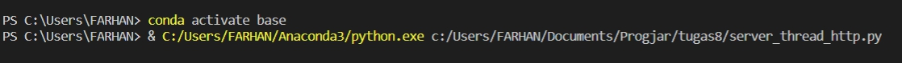
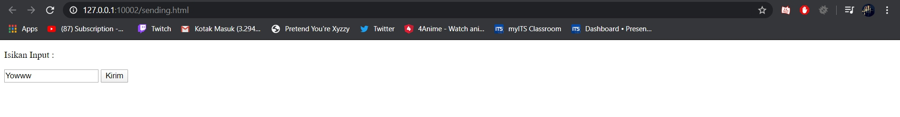
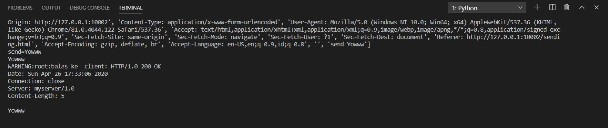

# Tugas 8
## Http Server cara kerja

* Langkah Pertama jalankan program server_thread_http.py  
  
* Kedua buka browser dan buka ip http://127.0.0.1:10002/sending.html  
  
* Ketiga masukkan input yang diinginkan  
  
* Berikut adalah hasil output  
  
* Berikut adalah hasil pada server_thread_http.py
  